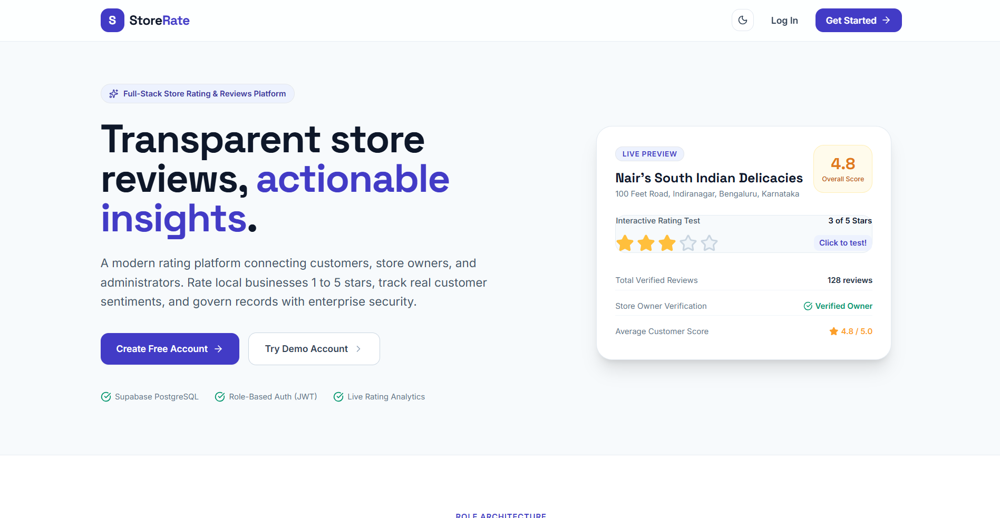
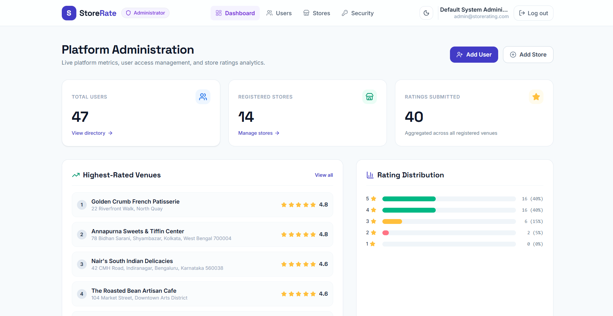
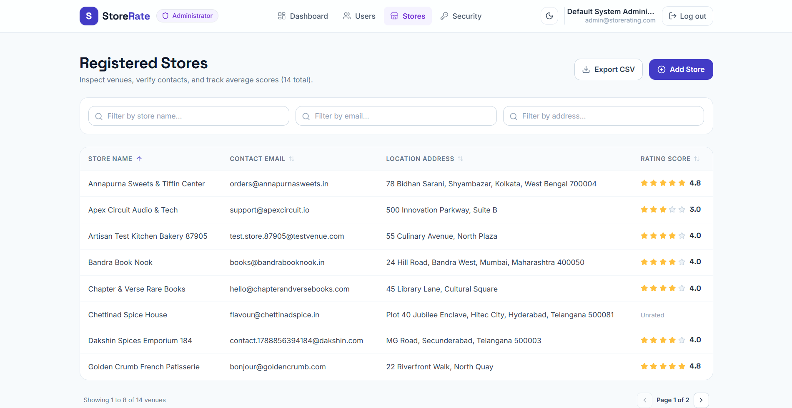
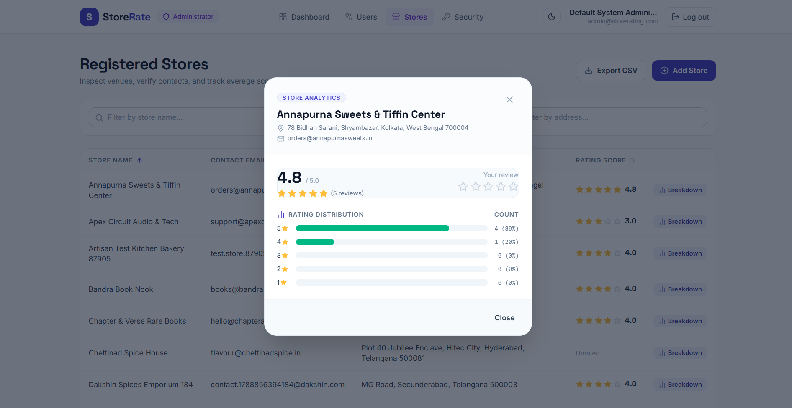

# StoreRate — Store Rating & Reviews Platform

[-61DAFB?logo=react&logoColor=black)](https://react.dev/)
[](https://tailwindcss.com/)
[](https://expressjs.com/)
[](https://sequelize.org/)
[](https://supabase.com/)
[-000000?logo=jsonwebtokens&logoColor=white)](https://jwt.io/)

A full-stack web application connecting Normal Users to browse and rate local Stores (1–5 stars), Store Owners to analyze customer sentiment and reviews, and System Administrators to govern accounts, venues, and platform metrics. Built for the FullStack Intern Coding Challenge.

---

## Table of Contents
- [1. Tech Stack](#1-tech-stack)
- [2. Features by Role](#2-features-by-role)
- [3. Architecture Overview](#3-architecture-overview)
- [4. Setup & Installation](#4-setup--installation)
- [5. Demo Accounts](#5-demo-accounts)
- [6. API Reference](#6-api-reference)
- [7. Screenshots](#7-screenshots)
- [8. Limitations & Extensions](#8-limitations--extensions)

---

## 1. Tech Stack

| Layer | Technologies |
|---|---|
| **Frontend** | React 18, Vite, Tailwind CSS, Framer Motion, Lucide Icons |
| **Typography** | Space Grotesk (Headings), Inter (Body) via Google Fonts |
| **Backend** | Node.js, Express.js, Sequelize ORM |
| **Database** | PostgreSQL hosted on Supabase (Supavisor Connection Pooler, Session Mode) |
| **Authentication** | JSON Web Tokens (JWT) with bcrypt hashing (10 salt rounds) |
| **Tooling & Code** | Modular controllers, centralized error handling, custom responsive tables |

---

## 2. Features by Role

### 🛡️ System Administrator
- **Analytics Dashboard**: Real-time totals for users, registered stores, and ratings; top 5 highest-rated venues, recent signups, and rating spread bar charts.
- **User Governance**: Browse, search, filter (by Name, Email, Address, Role), and sort all system accounts.
- **Account Creation**: Provision new Normal Users, Store Owners, or System Administrators with field-level validations.
- **Venue Management**: Register stores, associate verified Store Owners, and search/filter across venue directories.
- **User Detail Inspection**: Inspect profiles and view store metrics if the user is a Store Owner.
- **CSV Data Export**: Export complete user and store directories with one click.

### 👤 Normal User (Reviewer)
- **Public Landing & Self-Registration**: Interactive landing page with live rating test; signup form enforcing password and address complexity.
- **Store Discovery**: Search venues by store name and address in real time.
- **Interactive Ratings**: Submit or modify personal 1 to 5 star ratings.
- **Rating Distribution Modal**: View detailed breakdown bar charts showing 1★ through 5★ review counts for any venue.
- **Credential Updates**: Securely change password with verification.

### 🏪 Store Owner
- **Live Sentiment Dashboard**: View venue profile, overall average rating score, and total reviews count.
- **Reviewer Directory**: Table of all users who rated the store with names, emails, star scores, and submission dates.
- **Sorting & Export**: Multi-column sorting (Name, Email, Rating, Date) and direct CSV export of customer reviews.

---

## 3. Architecture Overview

StoreRate follows a decoupled client-server architecture. The Express API handles authentication, role-based access control (RBAC), and transactional queries via Sequelize against Supabase PostgreSQL. The Vite React frontend uses Tailwind CSS for layout styling, Framer Motion for responsive micro-interactions, and a centralized `AuthContext` to persist sessions.

```
store-rating-app/
├── backend/
│   ├── config/database.js       # Sequelize instance with SSL & Supavisor pooling
│   ├── controllers/             # Role-based business logic (admin, auth, store, owner)
│   ├── middleware/              # JWT verification, RBAC guard, central error handler
│   ├── models/                  # User, Store, Rating definitions and associations
│   ├── routes/                  # Express route handlers (/auth, /admin, /stores, /owner)
│   ├── seed/                    # Standalone admin seed + comprehensive demo seeder
│   ├── utils/                   # Shared validation rules and JWT helpers
│   └── server.js                # Express app entry point
└── frontend/
    ├── src/
    │   ├── api/axios.js         # Configured Axios instance with JWT interceptor
    │   ├── components/          # Navbar, SortableTable, StarRating, Modal, Skeletons
    │   ├── context/             # AuthContext, ToastContext
    │   ├── pages/
    │   │   ├── admin/           # Dashboard, Users, AddUser, UserDetail, Stores, AddStore
    │   │   ├── owner/           # OwnerDashboard
    │   │   ├── user/            # StoreList
    │   │   ├── LandingPage.jsx  # Unauthenticated public homepage
    │   │   ├── Login.jsx        # Login page with one-click Demo Account cards
    │   │   ├── Signup.jsx       # Normal user registration
    │   │   ├── ChangePassword.jsx
    │   │   └── NotFound.jsx     # 404 Route
    │   ├── utils/               # CSV exporter and client validators
    │   ├── App.jsx              # Application router
    │   └── main.jsx
    ├── tailwind.config.js       # Custom fonts & role color tokens
    └── vite.config.js
```

---

## 4. Setup & Installation

### Prerequisites
- Node.js 18+
- PostgreSQL instance (Supabase Connection Pooler, Session Mode port `5432`)

### 1. Backend Setup
```bash
cd backend
npm install
cp .env.example .env
```
Update `backend/.env` with your Supabase credentials:
- `DB_HOST`: Supabase pooler host (e.g. `aws-0-ap-south-1.pooler.supabase.com` or full connection URI)
- `DB_PORT`: `5432` *(Session Mode for prepared statements & DDL)*
- `DB_NAME`: `postgres`
- `DB_USER`: `postgres.<project-ref>`
- `DB_PASSWORD`: `<your-supabase-db-password>`
- `JWT_SECRET`: Random secure string

Seed demo data:
```bash
npm run seed:demo
```
Start the backend development server:
```bash
npm run dev
# Server running on http://localhost:5000
```

### 2. Frontend Setup
```bash
cd ../frontend
npm install
npm run dev
# Frontend running on http://localhost:5173
```

Visit `http://localhost:5173` in your browser.

---

## 5. Demo Accounts

> [!NOTE]
> All demo accounts are seeded via `npm run seed:demo` and are for challenge evaluation purposes only. You can also click any card on the [Login Page](http://localhost:5173/login) for instant one-click login.

| Role | Email | Password | Description |
|---|---|---|---|
| **System Administrator** | `admin@storerating.com` | `Admin@1234` | Full platform dashboard, user and store creation, exports |
| **Store Owner (Cafe)** | `owner.cafe@storerating.com` | `Owner@1234` | The Roasted Bean Artisan Cafe (5 reviews, ~4.6 avg) |
| **Store Owner (Books)** | `owner.books@storerating.com` | `Owner@1234` | Chapter & Verse Rare Books (4 reviews, 4.0 avg) |
| **Store Owner (Tech)** | `owner.tech@storerating.com` | `Owner@1234` | Apex Circuit Audio & Tech (4 reviews, 3.0 avg) |
| **Store Owner (Bakery)** | `owner.bakery@storerating.com` | `Owner@1234` | Golden Crumb French Patisserie (5 reviews, 4.8 avg) |
| **Store Owner (Gym)** | `owner.gym@storerating.com` | `Owner@1234` | Ironclad Athletic Performance *(0 reviews - empty state test)* |
| **Normal User** | `alex.wright@demo.com` | `User@1234` | Reviewer account with multiple submitted ratings |
| **Normal User** | `sam.jenkins@demo.com` | `User@1234` | Reviewer account with ratings |

---

## 6. API Reference

All protected endpoints require `Authorization: Bearer <jwt_token>`.

```
# Authentication
POST   /api/auth/signup               Normal User self-registration
POST   /api/auth/login                Authenticate credentials and receive JWT
PUT    /api/auth/password             Change own password
GET    /api/auth/me                   Retrieve authenticated user profile

# Administrator (Admin Role Only)
GET    /api/admin/dashboard           Totals, highest-rated venues, recent signups, spread
POST   /api/admin/users               Provision user (Normal User, Admin, Store Owner)
GET    /api/admin/users               Filter (name, email, address, role) + Sort
GET    /api/admin/users/:id           User details (+ store rating if Store Owner)
POST   /api/admin/stores              Register store (+ optional owner assignment)
GET    /api/admin/stores              Filter (name, email, address) + Sort
GET    /api/admin/owners              List unassigned Store Owners for store creation

# Stores & Ratings (Normal User Role)
GET    /api/stores                    Browse stores, search by name/address, user rating
GET    /api/stores/:storeId           Store rating distribution (1★-5★ breakdown)
POST   /api/stores/:storeId/ratings   Submit rating (1-5)
PUT    /api/stores/:storeId/ratings   Modify existing rating (1-5)

# Store Owner (Store Owner Role Only)
GET    /api/owner/dashboard           Store details, aggregate rating, list of raters
```

---

## 7. Screenshots

| Public Landing Page | Admin Dashboard |
|:---:|:---:|
|  |  |

| Store Directory & Ratings | Rating Distribution Modal |
|:---:|:---:|
|  |  |

*(Place project UI captures into `docs/screenshots/` to display preview previews in GitHub).*

---

## 8. Limitations & Extensions

- **Migrations**: Uses `sequelize.sync({ alter: true })` in development; production deployments can transition to Umzug or Sequelize CLI migrations.
- **Store Images**: Currently displays textual store addresses and metadata; could integrate AWS S3/Cloudinary for photo uploads.
- **Social Auth**: Could support OAuth2 (Google, GitHub) alongside email/password credentials.
